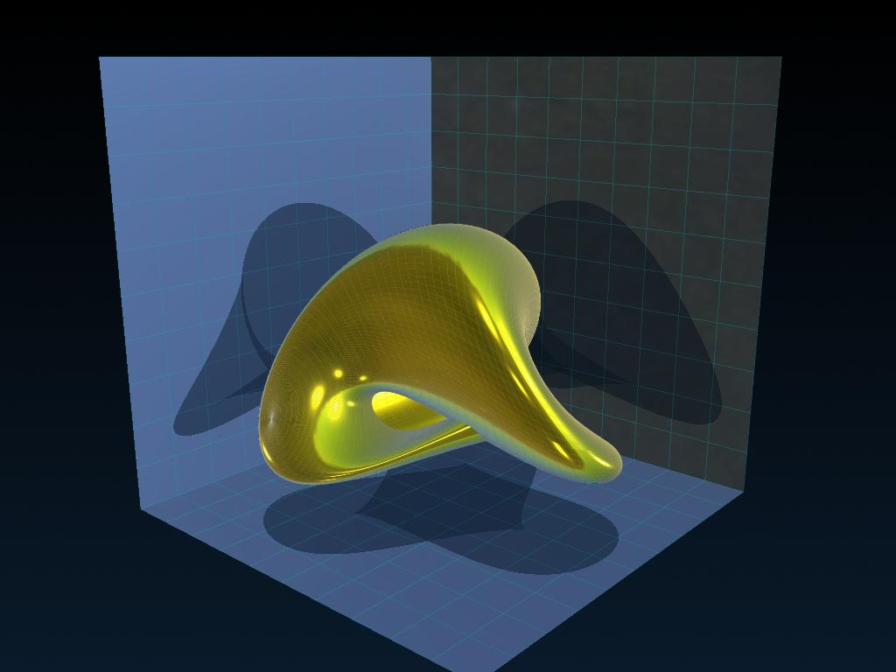

# PyVista 3D Visualizations & Mathematical Surfaces

  

Zbirka 3D vizualizacija i matematičkih ploha implementiranih u **PyVista** biblioteki s različitim naprednijim tehnikama poput PBR (Physically Based Rendering) i optimizacijom performansi.
S vremenom će se dodavati drugi primjeri kao me uhvati inspiracija.

## O projektu

Ovaj repozitorij služi kao centralno mjesto za moje eksperimente s Python vizualizacijom. Cilj je istražiti granice onoga što se može postići upotrebom modernih VTK omotača poput PyVista, 
uz korištenje naprednih tehnika sjenčanja, HDR mapa okoliša i hardverske optimizacije na **CachyOS (v3)** arhitekturi.

## Tehnologije

---
*Created with ❤️ by damba8-linux*
